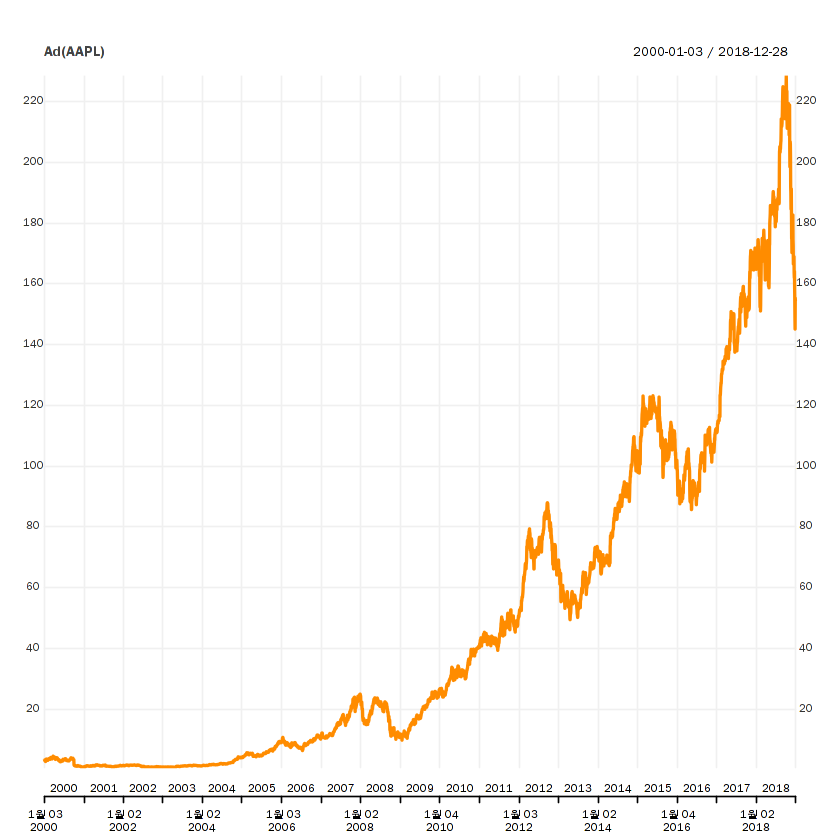
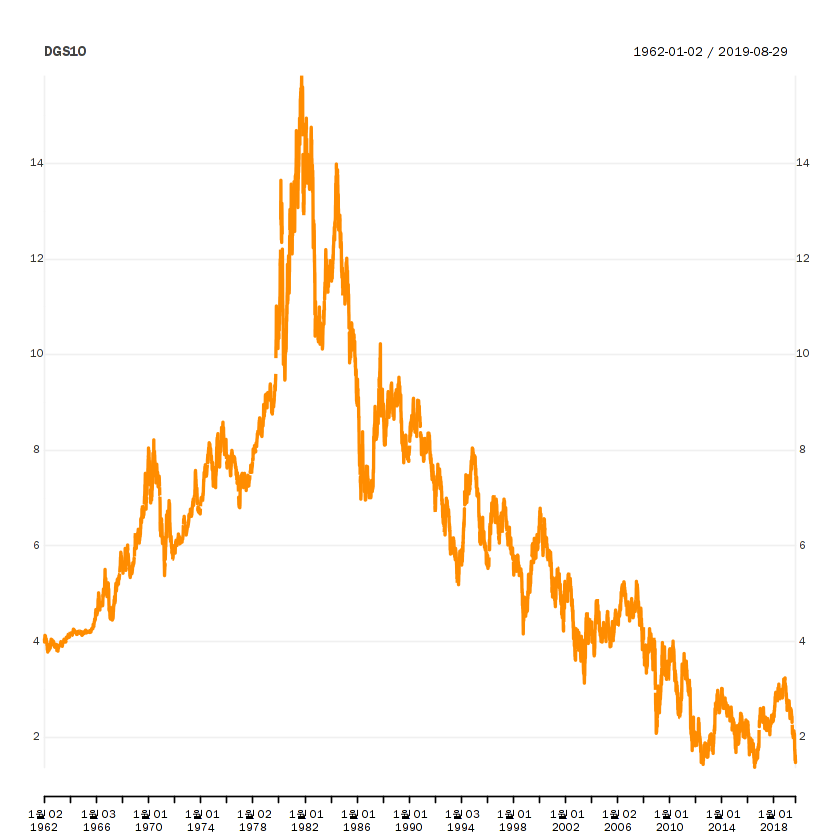

---
redirect_from:
  - "/mybook/chapter-03-api"
interact_link: content/Mybook/Chapter_03_API.ipynb
kernel_name: ir
has_widgets: false
title: 'chart test'
prev_page:
  url: /Mybook/general_text_by_md.html
  title: 'general edit by typora'
next_page:
  url: /intro.html
  title: 'Home'
comment: "***PROGRAMMATICALLY GENERATED, DO NOT EDIT. SEE ORIGINAL FILES IN /content***"
---


## Chapter 3 - API를 이용한 데이터 수집


* Quandl을 사용한 데이터 수집


* csv 데이터 load


<div markdown="1" class="cell code_cell">
<div class="input_area" markdown="1">
```R
url.aapl = "https://www.quandl.com/api/v3/datasets/WIKI/AAPL/data.csv?api_key=xw3NU3xLUZ7vZgrz5QnG"
data.aapl = read.csv(url.aapl)

head(data.aapl)

```
</div>

<div class="output_wrapper" markdown="1">
<div class="output_subarea" markdown="1">

<div markdown="0" class="output output_html">
<table>
<caption>A data.frame: 6 × 13</caption>
<thead>
	<tr><th scope=col>Date</th><th scope=col>Open</th><th scope=col>High</th><th scope=col>Low</th><th scope=col>Close</th><th scope=col>Volume</th><th scope=col>Ex.Dividend</th><th scope=col>Split.Ratio</th><th scope=col>Adj..Open</th><th scope=col>Adj..High</th><th scope=col>Adj..Low</th><th scope=col>Adj..Close</th><th scope=col>Adj..Volume</th></tr>
	<tr><th scope=col>&lt;fct&gt;</th><th scope=col>&lt;dbl&gt;</th><th scope=col>&lt;dbl&gt;</th><th scope=col>&lt;dbl&gt;</th><th scope=col>&lt;dbl&gt;</th><th scope=col>&lt;dbl&gt;</th><th scope=col>&lt;dbl&gt;</th><th scope=col>&lt;dbl&gt;</th><th scope=col>&lt;dbl&gt;</th><th scope=col>&lt;dbl&gt;</th><th scope=col>&lt;dbl&gt;</th><th scope=col>&lt;dbl&gt;</th><th scope=col>&lt;dbl&gt;</th></tr>
</thead>
<tbody>
	<tr><td>2018-03-27</td><td>173.68</td><td>175.15</td><td>166.92</td><td>168.340</td><td>38962839</td><td>0</td><td>1</td><td>173.68</td><td>175.15</td><td>166.92</td><td>168.340</td><td>38962839</td></tr>
	<tr><td>2018-03-26</td><td>168.07</td><td>173.10</td><td>166.44</td><td>172.770</td><td>36272617</td><td>0</td><td>1</td><td>168.07</td><td>173.10</td><td>166.44</td><td>172.770</td><td>36272617</td></tr>
	<tr><td>2018-03-23</td><td>168.39</td><td>169.92</td><td>164.94</td><td>164.940</td><td>40248954</td><td>0</td><td>1</td><td>168.39</td><td>169.92</td><td>164.94</td><td>164.940</td><td>40248954</td></tr>
	<tr><td>2018-03-22</td><td>170.00</td><td>172.68</td><td>168.60</td><td>168.845</td><td>41051076</td><td>0</td><td>1</td><td>170.00</td><td>172.68</td><td>168.60</td><td>168.845</td><td>41051076</td></tr>
	<tr><td>2018-03-21</td><td>175.04</td><td>175.09</td><td>171.26</td><td>171.270</td><td>35247358</td><td>0</td><td>1</td><td>175.04</td><td>175.09</td><td>171.26</td><td>171.270</td><td>35247358</td></tr>
	<tr><td>2018-03-20</td><td>175.24</td><td>176.80</td><td>174.94</td><td>175.240</td><td>19314039</td><td>0</td><td>1</td><td>175.24</td><td>176.80</td><td>174.94</td><td>175.240</td><td>19314039</td></tr>
</tbody>
</table>

</div>

</div>
</div>
</div>


* getSymbols() 함수를 이용한 수집


<div markdown="1" class="cell code_cell">
<div class="input_area" markdown="1">
```R
library(quantmod)

```
</div>

</div>


<div markdown="1" class="cell code_cell">
<div class="input_area" markdown="1">
```R
getSymbols('AAPL')

```
</div>

<div class="output_wrapper" markdown="1">
<div class="output_subarea" markdown="1">

<div markdown="0" class="output output_html">
'AAPL'
</div>

</div>
</div>
</div>


<div markdown="1" class="cell code_cell">
<div class="input_area" markdown="1">
```R
head(AAPL)

```
</div>

<div class="output_wrapper" markdown="1">
<div class="output_subarea" markdown="1">
{:.output_data_text}
```
           AAPL.Open AAPL.High AAPL.Low AAPL.Close AAPL.Volume AAPL.Adjusted
2007-01-03  12.32714  12.36857 11.70000   11.97143   309579900      10.44763
2007-01-04  12.00714  12.27857 11.97429   12.23714   211815100      10.67952
2007-01-05  12.25286  12.31428 12.05714   12.15000   208685400      10.60347
2007-01-08  12.28000  12.36143 12.18286   12.21000   199276700      10.65583
2007-01-09  12.35000  13.28286 12.16429   13.22429   837324600      11.54101
2007-01-10  13.53571  13.97143 13.35000   13.85714   738220000      12.09331
```

</div>
</div>
</div>


<div markdown="1" class="cell code_cell">
<div class="input_area" markdown="1">
```R
chart_Series(Ad(AAPL))
# chart_Series(Ad(data))

```
</div>

<div class="output_wrapper" markdown="1">
<div class="output_subarea" markdown="1">

{:.output_png}


</div>
</div>
</div>


<div markdown="1" class="cell code_cell">
<div class="input_area" markdown="1">
```R
data = getSymbols('AAPL',
                 from = '2000-01-01', to = '2018-12-31',
                  auto.assign = FALSE)
head(data)

```
</div>

<div class="output_wrapper" markdown="1">
<div class="output_subarea" markdown="1">
{:.output_data_text}
```
           AAPL.Open AAPL.High AAPL.Low AAPL.Close AAPL.Volume AAPL.Adjusted
2000-01-03  3.745536  4.017857 3.631696   3.997768   133949200      3.488905
2000-01-04  3.866071  3.950893 3.613839   3.660714   128094400      3.194754
2000-01-05  3.705357  3.948661 3.678571   3.714286   194580400      3.241507
2000-01-06  3.790179  3.821429 3.392857   3.392857   191993200      2.960991
2000-01-07  3.446429  3.607143 3.410714   3.553571   115183600      3.101249
2000-01-10  3.642857  3.651786 3.383929   3.491071   126266000      3.046704
```

</div>
</div>
</div>


<div markdown="1" class="cell code_cell">
<div class="input_area" markdown="1">
```R
ticker = c('FB', 'NVDA')
getSymbols(ticker)

```
</div>

<div class="output_wrapper" markdown="1">
<div class="output_subarea" markdown="1">

<div markdown="0" class="output output_html">
<ol class=list-inline>
	<li>'FB'</li>
	<li>'NVDA'</li>
</ol>

</div>

</div>
</div>
</div>


<div markdown="1" class="cell code_cell">
<div class="input_area" markdown="1">
```R
head(FB)

```
</div>

<div class="output_wrapper" markdown="1">
<div class="output_subarea" markdown="1">
{:.output_data_text}
```
           FB.Open FB.High FB.Low FB.Close FB.Volume FB.Adjusted
2012-05-18   42.05   45.00  38.00    38.23 573576400       38.23
2012-05-21   36.53   36.66  33.00    34.03 168192700       34.03
2012-05-22   32.61   33.59  30.94    31.00 101786600       31.00
2012-05-23   31.37   32.50  31.36    32.00  73600000       32.00
2012-05-24   32.95   33.21  31.77    33.03  50237200       33.03
2012-05-25   32.90   32.95  31.11    31.91  37149800       31.91
```

</div>
</div>
</div>


<div markdown="1" class="cell code_cell">
<div class="input_area" markdown="1">
```R
ss = getSymbols('005930.KS',
          from = '2000-01-01',to='2018-12-31',
               auto.assign = FALSE)

```
</div>

</div>


<div markdown="1" class="cell code_cell">
<div class="input_area" markdown="1">
```R
head(ss)

```
</div>

<div class="output_wrapper" markdown="1">
<div class="output_subarea" markdown="1">
{:.output_data_text}
```
           005930.KS.Open 005930.KS.High 005930.KS.Low 005930.KS.Close
2000-01-04           6000           6110          5660            6110
2000-01-05           5800           6060          5520            5580
2000-01-06           5750           5780          5580            5620
2000-01-07           5560           5670          5360            5540
2000-01-10           5600           5770          5580            5770
2000-01-11           5820           6100          5770            5770
           005930.KS.Volume 005930.KS.Adjusted
2000-01-04         74195000           0.090599
2000-01-05         74680000           0.082740
2000-01-06         54390000           0.083333
2000-01-07         40305000           0.082147
2000-01-10         46880000           0.085558
2000-01-11         59745000           0.085558
```

</div>
</div>
</div>


* FRED 데이터


<div markdown="1" class="cell code_cell">
<div class="input_area" markdown="1">
```R
getSymbols("DGS10", src='FRED')

```
</div>

<div class="output_wrapper" markdown="1">
<div class="output_subarea" markdown="1">

<div markdown="0" class="output output_html">
'DGS10'
</div>

</div>
</div>
</div>


<div markdown="1" class="cell code_cell">
<div class="input_area" markdown="1">
```R
chart_Series(DGS10)

```
</div>

<div class="output_wrapper" markdown="1">
<div class="output_subarea" markdown="1">

{:.output_png}


</div>
</div>
</div>

